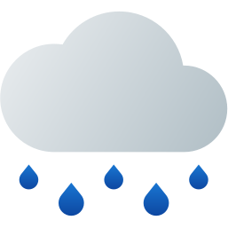
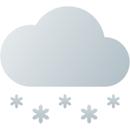
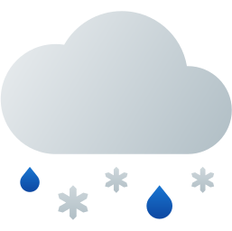
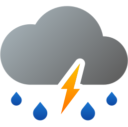

  
  <h1>Material Weather Icons</h1>

### About
A free and open source weather icon pack, designed to work well with Material Design components. While many icon packs are over simplified (eg. Google's weather icons) these icons aim to strike a balance between simplicity and detail. They utilize large, flat shapes and the [Material Design color pallet](https://htmlcolorcodes.com/color-chart/material-design-color-chart/).

### Icons

### Intergration

Here is an example of how all the WMO codes provided by Open Mateo could be displayed with this icon pack.

|  WMO code | Icon |
| ------------- | ------------- |
| 0, 1 |    |
| 2 |   |
| 3 |  |
| 45, 48 |  |
| 61, 63, 65, 80, 81, 82 |  |
| 51, 53, 55 |  |
| 71, 73, 75, 85, 86 |  |
| 56, 57, 66, 67, 77 |  |
| 95 |  |
| 96, 99 |  |

### License

 Material Weather Icons is licensed under [CC BY-SA 4.0](https://creativecommons.org/licenses/by-sa/4.0/).
